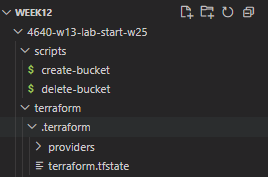
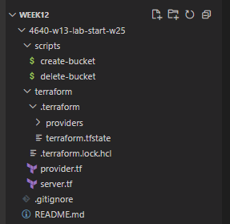

# 4640-w13-lab-start-w25

I began by cloning the starter code provided by my instructor:

```bash
git clone https://gitlab.com/cit_4640/4640-w13-lab-start-w25.git
cd 4640-w13-lab-start-w25
```

Inside the project, I explored the scripts/ directory, which contained helper shell scripts for creating and deleting S3 buckets. I reviewed and understood how the create-bucket script works — it uses AWS CLI to create a bucket in a specified region (us-west-2 by default).

I also examined the Terraform configuration inside the terraform/ directory to get familiar with the provider and infrastructure setup.

## S3 Bucket Creation
I initially attempted to use the provided ./create-bucket script with the bucket name A01301238-bucket, but I encountered an error because AWS S3 bucket names must be lowercase. After identifying this issue, I corrected the bucket name to use all lowercase characters.

Eventually, I decided to create the bucket using the AWS Console GUI to ensure proper configuration. I named the bucket:

```bash
labweek14-a01301238-bucket
```

I confirmed that it was created in the us-west-2 region.

## Updating provider.tf

In the terraform/provider.tf file, I added the backend block to configure Terraform to store the state file remotely in my S3 bucket.

## Terraform Initialization and Apply

After configuring the backend, I initialized Terraform with:

```bash
terraform init
```

Then I ran:

```bash
terraform plan
terraform apply
```

During this process, Terraform connected to the remote backend and successfully created the state file in my S3 bucket.

## Screenshots

**State File Only:**


**State File + Lock File (during plan/apply):**


## Questions

### Ques1. When is the state file created?
The state file is created immediately after I run the terraform apply command and the infrastructure is successfully provisioned. It serves as a record of the real-world resources that Terraform manages. This file contains the current state of the resources, including their attributes and metadata. By storing the state file in a remote S3 bucket, Terraform can manage shared infrastructure more effectively across teams and machines. The state file is crucial for determining what changes need to be applied during future runs of terraform plan or terraform apply.

### Ques2. When is the lock file present?
The lock file is present only while Terraform is actively performing an operation that reads or writes the state file. For example, it appears during commands such as terraform plan, terraform apply, and terraform destroy. Its purpose is to prevent simultaneous access to the state file, which could cause corruption or inconsistent results. If another user or system tries to run Terraform operations on the same backend while a lock is active, they will be blocked until the lock is released. This ensures that Terraform operations are atomic and safe.

### Ques3. Is the lock file always in the bucket after it is created?
No, the lock file is temporary and is only present while a Terraform operation is in progress. Once the operation completes, Terraform automatically removes the lock file from the S3 bucket. It is not meant to persist like the state file. This behavior ensures that future Terraform commands can proceed without conflict, assuming no other processes are actively working with the backend. If the lock file remains in the bucket after the operation, it could indicate that a previous process was interrupted, and manual intervention may be required to remove it.
